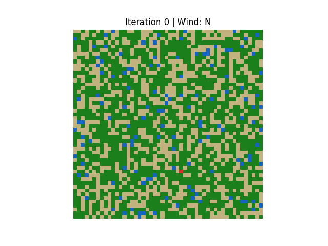

# 🌲 Symulacja Pożaru Lasu (Forest Fire Simulation)

[English version](README.md)

Projekt symulacji pożaru lasu w języku Python, przygotowany w ramach przedmiotu **Symulacje Komputerowe**. 
Symulacja modeluje rozprzestrzenianie się ognia na dwuwymiarowej siatce lasu przy użyciu reguł probabilistycznych, automatów komórkowych oraz dynamicznych czynników środowiskowych, takich jak wiatr i odradzanie się roślinności.

---

## 🚀 Status Projektu

Projekt jest **ukończony**.
Wszystkie kluczowe komponenty symulacji, w tym logika rozprzestrzeniania ognia, dynamiczny wpływ wiatru, wizualizacja oraz eksport wyników, zostały w pełni zaimplementowane.

---

## 🌱 Zaimplementowane Funkcje

### ✔️ Inicjalizacja Lasu (`init_forest`)
Odpowiada za przygotowanie pełnego środowiska początkowego dla symulacji:

* Tworzy pustą siatkę lasu o konfigurowalnym rozmiarze.
* Losowo rozmieszcza komórki **WODY** na podstawie `water_density`.
* Losowo rozmieszcza komórki **DRZEW** na podstawie `tree_density`.
* Zapewnia, że drzewa nigdy nie nadpisują pól z wodą.
* Inicjalizuje równoległą macierz `burned_age`.
* Wybiera jedno losowe drzewo i **podpala je** (stan `BURNING`).

### ✔️ Logika Rozprzestrzeniania Ognia (`spread_fire`)
Implementuje reguły automatów komórkowych rządzące propagacją ognia:

* Probabilistyczne rozprzestrzenianie ognia przy użyciu sąsiedztwa Moore'a (8 kierunków).
* Ogień rozprzestrzenia się wyłącznie na sąsiednie komórki **DRZEW**.
* Komórki **WODY** całkowicie blokują rozprzestrzenianie się ognia.
* Obsługa **samozapłonu** z konfigurowalnym prawdopodobieństwem.
* Płonące komórki przechodzą w stan **SPALONY** (BURNED).

### ✔️ Dynamiczny Wpływ Wiatru
Warunki środowiskowe wpływające na kierunek pożaru:

* Obsługiwane kierunki wiatru: **N, S, E, W**.
* Kierunek wiatru modyfikuje prawdopodobieństwo zapłonu.
* Kierunek wiatru zmienia się **dynamicznie co określoną liczbę iteracji**.
* Historia wiatru jest zapisywana dla każdego kroku symulacji.
* Aktualny kierunek wiatru jest wyświetlany bezpośrednio na wizualizacji.

### ✔️ Odradzanie się Roślinności
Mechanizm regeneracji po pożarze:

* Spalone komórki pozostają w stanie **BURNED** przez określoną liczbę kroków.
* Drzewa automatycznie regenerują się po upływie okresu odrastania.

### ✔️ Pętla Symulacji (`simulate_fire`)
Kontroluje ewolucję czasową systemu:

* Pętla symulacji oparta na zdarzeniach.
* Symulacja trwa do momentu wygaśnięcia wszystkich pożarów.
* Dodatkowe "kroki wyciszenia" zapobiegają przedwczesnemu zakończeniu z powodu samozapłonu.
* Pełna historia stanów lasu jest gromadzona na potrzeby wizualizacji.

### ✔️ Wizualizacja i Wyniki
Graficzna reprezentacja symulacji:

* Wizualizacja zaimplementowana przy użyciu **Matplotlib**.
* Dyskretne mapowanie kolorów dla wszystkich stanów lasu.
* Animowana wizualizacja rozprzestrzeniania się ognia w czasie.
* Eksport wyników do formatu **GIF**.
* Animacja wyświetla numer iteracji oraz aktualny kierunek wiatru.

**Podgląd Symulacji:**



---

## 🗂 Struktura Projektu

```text
Forest_Fire_Simulation/
│
├── forest_fire/
│   ├── forest.py      # logika inicjalizacji lasu
│   ├── spread.py      # reguły rozprzestrzeniania ognia
│   ├── simulate.py    # kontroler symulacji i ewolucja czasowa
│   ├── visualize.py   # wizualizacja i eksport animacji
│   ├── states.py      # definicje stanów komórek
│   └── __init__.py
│
├── outputs/
│   └── forest_fire_simulation.gif
│
├── run.py             # główny punkt wejścia
├── requirements.txt
├── README.md
└── .gitignore
```

---

## 🧪 Uruchamianie Projektu

Po zainstalowaniu zależności:

```bash
pip install -r requirements.txt
```

Uruchom symulację:

```bash
python run.py
```

---

## 🔧 Wymagania

* Python 3.9+
* NumPy
* Matplotlib
* Pillow

---

## 📚 Kontekst Akademicki

Projekt stworzony na potrzeby kursu **Symulacje Komputerowe**. Demonstruje koncepcje takie jak:

* automaty komórkowe
* probabilistyczne przejścia stanów
* modelowanie środowiskowe
* wizualizacja systemów dynamicznych

---

## 👤 Autor

**Kamil Matusiak**  
Symulacja Pożaru Lasu — Rok Akademicki 2025/2026
